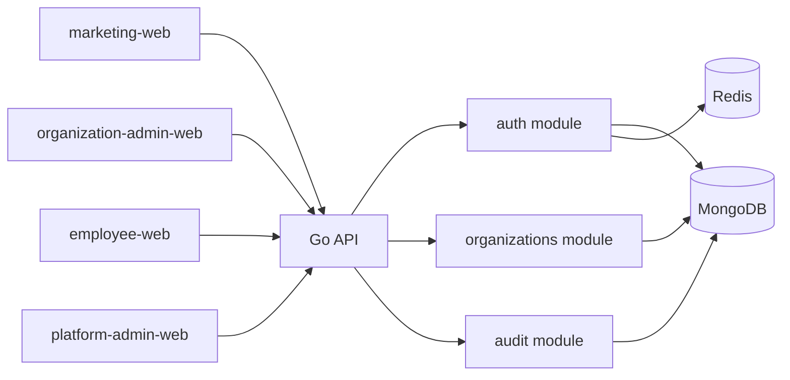

# Architecture — Phase 0

```mermaid
flowchart LR
  Marketing[marketing-web] --> API[Go API]
  OrgAdmin[organization-admin-web] --> API
  Employee[employee-web] --> API
  Platform[platform-admin-web] --> API
  API --> Auth[auth module]
  API --> Orgs[organizations module]
  API --> Audit[audit module]
  Auth --> Mongo[(MongoDB)]
  Orgs --> Mongo
  Audit --> Mongo
  Auth --> Redis[(Redis)]
```

Modular monolith: domain packages under `internal/` share one deployable API process.
