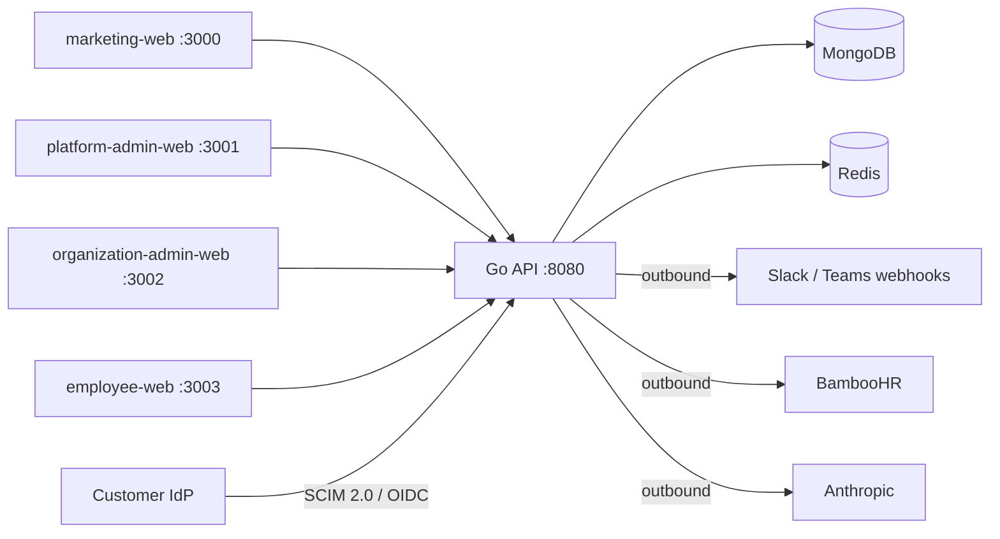

# Architecture overview

LaunchPad is a **modular monolith**: one Go API process (`apps/api`) serves all
four Next.js frontends, backed by MongoDB (persistence) and Redis (sessions,
SSO state). Domain logic lives in self-contained packages under `internal/`;
`internal/app/app.go` is the only place modules are wired together.

## Layers and conventions

Per `AGENTS.md`:

- **Handlers are thin** — decode, authorize, call the service, map errors.
- **Services are framework-free** — no HTTP imports in domain logic.
- **Repository interfaces live in the domain package**, with Mongo (and Redis)
  adapters in `internal/<domain>/mongo|redis` asserting the interface at
  compile time (`var _ Iface = (*Store)(nil)`).
- **Mongo documents do not leak as API responses** — response DTOs/mappers at
  the handler boundary.
- **Cross-module calls use explicit small interfaces** (e.g. `OrgDirectory`,
  `Provisioner`, `AssignmentSource`), adapted in `internal/app`.
- **Logging via `log/slog` only.**

Shared plumbing lives in `pkg/`: `config` (env), `httpx` (JSON envelope,
error shape), `middleware` (authn/authz, rate limiting, CORS, request
logging), `mongo`/`redis` (clients), `security` (JWT issue/parse, password
hashing, token generation), `safehttp` (SSRF-safe outbound HTTP).

## HTTP shape

Single chi router (`internal/app/app.go` `newRouter`):

- `RequestID` → `RealIP` → `RequestLogger` → `Recoverer` → `CORS`.
- `/healthz` (liveness) and `/readyz` (pings Mongo + Redis).
- `/api/v1` public group — register/login/refresh, invitation acceptance,
  leads, public CMS, SSO start/callback — rate-limited per client IP
  (20 req/min).
- `/api/v1` private group — `middleware.Authenticate` (JWT + Redis session
  check), then `RequirePlatform` (platform routes) or `RequireOrganization`
  (tenant routes); tenant writes are gated per-route by
  `middleware.RequirePermission` (PRD 6.3 RBAC, `internal/roles`), and
  manager-scoped handlers additionally use
  `organizations.CanManageOrganization`.
- `/api/v1/scim/v2/*` — SCIM 2.0, authenticated per-tenant bearer token.
- The assistant group is additionally rate-limited (10 req/min) because it
  calls a paid LLM.

## Domain modules (21)

| Module | Responsibility | Notable externals |
| --- | --- | --- |
| `auth` | Accounts, register/login/refresh/logout, sessions, invitations | Redis session store |
| `organizations` | Tenants, memberships, member role management, branding | — |
| `roles` | RBAC permission registry, built-in roles, custom roles (enterprise) | — |
| `platform` | Cross-tenant admin (org suspend/activate, overview) | — |
| `audit` | Immutable per-tenant audit events | — |
| `departments` | Departments and job roles | — |
| `employees` | Employee records, portal-access provisioning | — |
| `journeys` | Onboarding journey templates, draft/publish versioning | — |
| `assignments` | Journey assignments, step progress, approvals | — |
| `analytics` | Onboarding summary metrics | — |
| `notifications` | In-app notifications + chat fan-out | Slack/Teams webhooks (`webhook/`) |
| `knowledge` | Knowledge documents, approval-to-index lifecycle | feeds the assistant indexer |
| `assistant` | Grounded Q&A with citations | Anthropic (`anthropic/`), embeddings (`embed/`) |
| `cms` | Marketing pages, draft/publish | — |
| `leads` | Marketing demo/lead capture | — |
| `billing` | Plans and subscriptions | — |
| `featureflags` | Global flags + per-tenant overrides, plan gating | — |
| `support` | Support tickets (org and platform sides) | — |
| `marketplace` | Moderated global journey templates, installations, ratings | creates tenant journey drafts |
| `sso` | Per-tenant OIDC SSO | OIDC verifier (`oidc/`), Redis state store |
| `scim` | SCIM 2.0 user/group provisioning | bearer tokens hashed at rest |
| `hris` | HRIS directory sync and apply | BambooHR client (`bamboohr/`) |

`internal/app` builds each module's store → service → handler, adapts the
cross-module ports, ensures Mongo indexes at startup (shared with
`scripts/migrate_indexes` via `MongoIndexers`), and registers routes.

## Frontends

Four Next.js apps under `apps/`, all consuming the API through
`packages/api-client` (Zod-validated at the boundary) and sharing primitives
from `packages/ui`:

- `marketing-web` — public site, CMS-driven pages, lead capture, signup.
- `platform-admin-web` — LaunchPad staff control plane.
- `organization-admin-web` — HR admin console.
- `employee-web` — employee portal (assignments, notifications, assistant).

## Contracts and infra

- `contracts/openapi/openapi.yaml` — REST contract, kept route-complete.
- `contracts/events/audit-events.md` — audit-event (domain event) catalog.
- `contracts/webhooks/chat-webhooks.md` — outbound Slack/Teams payloads.
- `infra/` — Terraform, Kubernetes, Helm, Argo CD for deployment.
- `migrations` are handled by `scripts/migrate_indexes` (`make migrate-indexes`).

## Historical note: Phase 0

The original Phase-0 scope was exactly three modules — `auth`,
`organizations`, `audit` — behind the same four frontends and the same
MongoDB/Redis footing (ADR `docs/decisions/0001-mongodb-redis.md`). Everything
above that row in the module table is post-Phase-0 growth; the layering
conventions have not changed.
